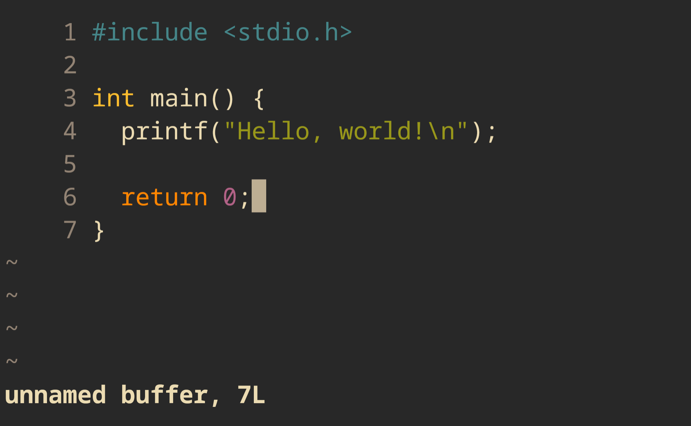

# Madlad

MADLAD is a line-oriented, fullscreen modal text editor inspired by
`vi`, but with an aggresively minimal core that outsources scripting
to the POSIX `sh`.



MADLAD implements the most basic full-screen modal text editor
possible, focusing on outsourcing as many elements as possible to
external programs.

To that end, there is no scripting language like Lua or (god forbid)
Vimscript in MADLAD - instead, shell scripts are used. These scripts
interact with the editor through
[RPC](https://github.com/beauconstrictor/csrpc) commands. Unlike
Neovim, which doesn't fully commit to the RPC idea, MADLAD uses this
same system in both the `:` commands and config scripts - you can
put commands like `setv highlightcol 80` that you would run from
within the editor straight in your `~/.madladrc`.

In addition, syntax highlighting is implemented in `*.so` files. These
highlighters are *incredibly* basic, and highlight individual lines
with no actual parsing of syntax. Currently, only a few languages
have support.

The biggest limitation with editing in MADLAD is that you cannot
combine motions with operations to form complex actions like in `vim`.
All you can do is move the cursor around and delete individual
characters (there are no registers).

## Building

To build MADLAD, install `clang` and `make` and run:

```
$ git clone "https://github.com/beauconstrictor/madlad"
$ cd madlad
$ make
```

This will create the `./build/madlad` binary, but you cannot run this
directly as it will not be able to find it's required runtime files.
If you don't want to install MADLAD fully, you can use `make run`
which will point MADLAD to the runtime files in `./build/`.

## Installing

To install MADLAD locally, use `make install` and add this to your
system's `~/.bashrc` equivalent:

```sh
export MADLAD_INSTALL=~/.local/share/madlad/
```

# DSH

DSH is the scripting language of MADLAD. In reality, DSH is just the
POSIX `sh`, so all of that syntax carries over. All you need to know
are the basic commands that DSH implements, which you can compose to
create more complex actions. You can find these in
[madlad.sh](src/dsh/madlad.sh).

If you want to write a DSH script, you need to add this line at the
beginning:

```sh
eval $MADLAD_IMPORT
```

...(and optionally a shebang). This will import all of MADLAD's
commands into your script so that they are available to use.

## Platform Support

MADLAD is heavily dependent on a POSIX-like environment, so does not
support Windows. You could potentially try Cygwin, but you'll have to
figure that out for yourself

## License

MADLAD uses the open source MIT license, meaning you can do almost
anything you want with the code, as long as you keep that license
message yourself.
